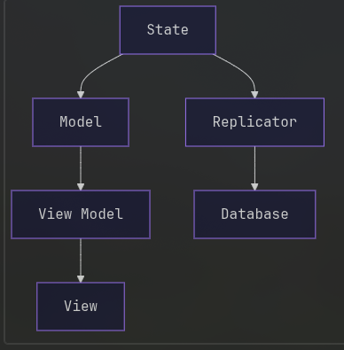

Lost and Found documentation
============================

Core
====
The core is built around an immutable state object that includes a replica of the items table, as well as any transient application specific state like search box contents. 
Any update to the state creates a new state object with the applied changes, other areas of the application can observe these changes e.g. models and the database layer.

This state is broken down into individual entities, like items, and search parameters. 
These entities can then be composed into a hierarchy which handles processing updates to individual entities.
The UI and the database can subscribe to updates to a specific entity, as well as a specific property on a certain entity. 

UI
==
Models monitor changes to the state object and shrink them down to individual observables, which can be connected to the UI using view models. These do not contain any UI code and are be unit tested.
View models handle connecting observables from the staging area to UI, for example connecting the name of an item to an element in the treeview. They also construct the UI by composing other view models i.e. ButtonViewModel.
Views contain the actual UI logic i.e. tkinter code. These only exist for primitive widgets and get composed in view models to create more complex UI. This minimises the amount of tkinter code.

Database
========
The database is injected as a service, and has multiple implementations e.g. file, or in memory. A database can execute SQL queries.
Replicators handle executing queries to update the database when application state is modified.
Replicators also initialise the application state based on the contents of the database.

Custom types can be stored into the database using converters, which tell the database how to convert the type to and from a bytes object.
Converters can be registered into the database at startup to handle custom types like datetimes, or item category enums. 

Architecture Diagram
====================

.. autosummary::
   :toctree: _autosummary
   :template: custom-module-template.rst
   :recursive:

   lost_and_found

